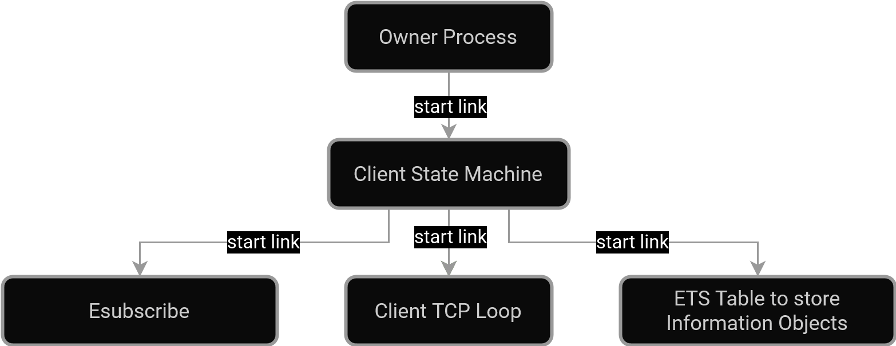

# IEC104 Protocol Library

## Description
**IEC-60870-5 (IEC101 & IEC104)** is a standard for power system monitoring, control, and other related communications to automate electric power systems.  
This library implements communication with devices that use this protocol.

## Getting started
Used Erlang OTP version: 25 [erts-13.2].
### Executing
To use the library, you'll need to [install rebar3](https://rebar3.org/).
1. Clone the repo  
```
git clone https://github.com/pickoticko/IEC-60870-5.git
```
2. Compile the project  
```
rebar3 compile
```
3. Launch the project  
```
rebar3 shell
```
### Adding to the existing project
Add dependency to your ```rebar.config```
```
{iec60870, {git, "https://github.com/pickoticko/IEC-60870-5.git", {branch, "master"}}}
```  
Don't forget to add the library to the relx release (if needed)
```
{iec60870, load}
```

## Dependencies
- [eserial](https://github.com/vzroman/eserial)
- [esubscribe](https://github.com/vzroman/esubscribe)

## Interface
| Function               | Arguments                                      | Returns    | Description  |
| :--------------------- |:---------------------------------------------- | :--------- | :----------- |
| **`start_client/1`**   | Settings                                       | Client     | Starts the client |
| **`start_server/1`**   | Settings                                       | Server     | Starts the server |
| **`stop/1`**           | Client / Server                                | OK         | Stops a server or a client |
| `subscribe/2`          | Client / Server, SubscriberPID                 | OK         | Subscribes to all existing addresses |
| `subscribe/3`          | Client / Server, SubscriberPID, Address / List | OK         | Subscribes to an address or a list of addresses |
| `unsubscribe/2`        | Client / Server, SubscriberPID                 | OK         | Removes subscription from SubscriberPID entirely |  
| `unsubscribe/3`        | Client / Server, SubscriberPID, Address        | OK         | Removes subscription from the given address |  
| `read/1`               | Client / Server                                | List       | Reads all existing addresses |
| `read/2`               | Client / Server, Address                       | Object     | Read a value from the cache by an address |
| `write/2`              | Client / Server, Address, Value                | OK         | Writes a value to the cache |

## Usage
To start the connection, both ```start_client``` and ```start_server``` require a map passed with arguments provided below:  

### Parameters description for IEC101
| Key          | Data type | Description                     | Value                            |
|:---------    |:----------|:--------------------------------|:----------------------------------|
| name         | Atom      | Name of the connection          | Any unique                        |
| type         | Atom      | Type of the connection          | '101' or '104'                    |
| coa          | Integer   | Common Address                  | Depends on COA size               |
| org          | Integer   | Originator Address              | Depends on ORG size               |
| coa_size     | Integer   | Common Address Size             | From 1 to 2                       |
| org_size     | Integer   | Originator Address Size         | From 0 to 1                       |
| ioa_size     | Integer   | Information Object Address Size | From 1 to 3                       |
| groups       | List      | Group requests list             | Described below                   |
| port         | String    | Serial port name                | Example: "/dev/ttyUSB0"           |
| balanced     | Boolean   | Enable balanced transmission    | Default: unbalanced transmission  |
| baudrate     | Integer   | Communication speed             | Recommended: from 9600 to 115200  |
| parity       | Integer   | Parity bit                      | 0 - none, 1 - even, 2 - odd       |
| stopbits     | Integer   | The number of stop bits         | From 1 to 2                       |
| bytesize     | Integer   | The number of data bits         | From 7 to 8                       |
| address      | Integer   | Data Link Address               | Depends on Data Link Address size | 
| address_size | Integer   | Data Link Address size          | From 1 to 2                       |
| timeout      | Integer   | Connect timeout                 | Any                               |
| attempts     | Integer   | Attempts to connect             | Any                               |

> [!IMPORTANT]
> **Timeout** value should be specified in **milliseconds**.
>   
> The **originator address** (**ORG**), which is the second byte of the **Cause of Transmission** (**COT**),
> can have a value of either 1 or 0, indicating whether the byte is suspended or not.

> [!NOTE]
> Group requests description 
> If group number 0 is used, all data is requested from the server. For other group numbers, only information objects belonging to that group are requested from the server.
> ```erlang
> % ID - the numbering of group in the protocol ranges from 0 to 16 inclusive.
> % Update - the frequency of sending group requests (milliseconds)
> % Timeout - timeout for responding to a group request (milliseconds)
> groups => [#{id => 1, update => 1000, timeout => 2000}, #{...}, ...]
> ```

### IEC101 client / server example
```erlang
#{
	name => iec101_client_example, 
	type => '101', 
	groups => [], 
	coa_size => 2,
	org_size => 1, 
	ioa_size => 3, 
	coa => 1,   
	org => 0,     
	connection => #{
		port => "/dev/ttyUSB0",  
		balanced => false,        
		port_options => #{      
			baudrate => 9600, 
			parity => 1,     
			stopbits => 1,     
			bytesize => 8    
		},
		address => 1,      
		address_size => 2, 
		timeout => 5000,   
		attempts => 99  
	}
},
```

### Parameters description for IEC104
| Key      | Data type | Description                     | Value                         |
|:---------|:----------|:--------------------------------|:------------------------------|
| name     | Atom      | Name of the connection          | Any unique                    |
| type     | Atom      | Type of the connection          | '101' or '104'                |
| coa      | Integer   | Common Address                  | Depends on COA size           |
| org      | Integer   | Originator Address              | Depends on ORG size           |
| coa_size | Integer   | Common Address Size             | From 1 to 2                   |
| org_size | Integer   | Originator Address Size         | From 0 to 1                   |
| ioa_size | Integer   | Information Object Address Size | From 1 to 3                   |
| groups   | List      | Group requests list             | Described below               |
| host     | Tuple     | IPv4 address of the server      | Any                           |
| port     | Integer   | Port number                     | Recommended: 2404 or 2405     |
| t1       | Integer   | Packets timeout                 | Recommended: 1 to 255 seconds |
| t2       | Integer   | Acknowledge timeout             | Recommended: 1 to 255 seconds |
| t3       | Integer   | Test packets timeout            | Recommended: 1 to 255 seconds |
| k        | Integer   | Maximum transmitted APDUs       | 1 to 32767                    |
| w        | Integer   | Maximum received APDUs          | 1 to 32767                    |

> [!IMPORTANT]
> **T1**, **T2**, and **T3** values should be specified in **milliseconds**.

> [!NOTE]
> Group requests description 
> If group number 0 is used, all data is requested from the server. For other group numbers, only information objects belonging to that group are requested from the server.
> ```erlang
> % ID - the numbering of group in the protocol ranges from 0 to 16 inclusive.
> % Update - the frequency of sending group requests (milliseconds)
> % Timeout - timeout for responding to a group request (milliseconds)
> groups => [#{id => 1, update => 1000, timeout => 2000}, #{...}, ...]
> ```

### IEC104 client example 
```erlang
#{
	name => iec104_client_example, 
	type => '104', 
	groups => [], 
	coa_size => 2, 
	org_size => 1, 
	ioa_size => 3, 
	coa => 1,    
	org => 0,   
	connection => #{
		host => {127, 0, 0, 1}, 
		port => 2404, 
		t1 => 30000,  
		t2 => 5000,   
		t3 => 15000,  
		k => 12,      
		w => 8        
	}
},
```

### IEC104 server example: all settings are identical to the client, except without the ```host``` field.

## Architecture diagrams
### IEC104 client diagram


## Authors
Contributors names and contact info:  
- Vozzhenikov Roman, vzroman@gmail.com  
- Alikhan Tokenov, alikhantokenov@gmail.com  
